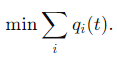
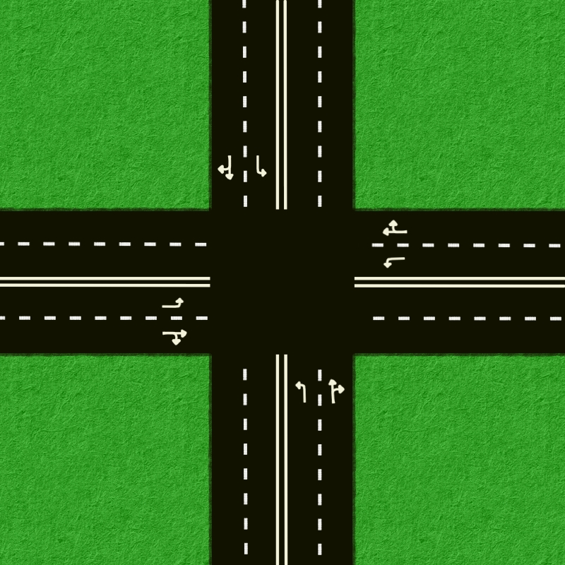

# Optymalizacja przełączania sygnalizacji świetlnej na skrzyżowaniu

## Opis problemu:
Optymalizacja przełączania sygnalizacji świetlnej na skrzyżowaniu w celu minimalizacji liczby pojazdów oczekujących przy jednoczesnym zapewnieniu płynnego i bezpiecznego ruchu.

## Model matematyczny:

### Zmienne decyzyjne
(Mogą być używanne zamiennie) 
* ***xi(t)*** – stan sygnalizacji na pasie i (1-zielone, 0-czerwone)
* ***Ti_on, Ti_off*** - czas włączenia i wyłączenia sygnalizacji na pasie i 

### Zmienne stanu
* ***qi(t)*** – liczba pojazdów oczekujących w kolejce na pasie i  
  ***qi(t+1) = qi(t) + ai(t) - vi(t) * xi(t)***
* ***vi(t)*** – przepustowość na pasie i  
* ***ai(t)*** – przyrost pojazdów na pasie i    

### Ograniczenia:
* ***Tmin, Tmax*** – minimalny i maksymalny czas trwania zielonego światła  
* ***Top*** – czas pomiędzy przełączeniem świateł (żółte światło)  
* ***Ci*** – lista pasów kolidujących z pasem i
* ***Di*** - lista kierunków w jakie można pojechać z pasa i
* W jednej rotacji muszą zaświecić się wszystkie światła  
 
### Funcja celu

### Możliwe podejścia:
#### 1. Stały czas przełączania:
Określone czasy trwania zielonego światła są takie same dla każdego cyklu, niezależnie od aktualnego natężenia ruchu.

#### 2. Adaptacyjne sterowanie:
Wykorzystanie danych o bieżącym natężeniu ruchu (np. z systemów wizyjnych, sensorów) do dynamicznego dostosowywania cyklu świateł.

### Model skrzyżowania
Na przykładzie tego skrzyżowania będzie przeprowadzana optymalizacja, jednak celem będzię możliwie jak najbardziej uogólnić model aby miał zastosowania również do innych skrzyżowań.  

